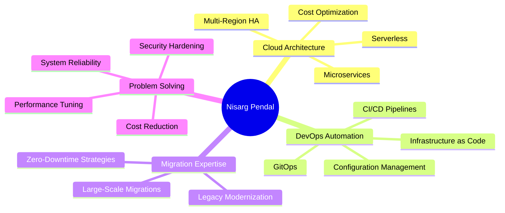

<div align="center">

# 👋 Hi, I'm Nisarg Pendal

### DevOps Engineer | Cloud Infrastructure Specialist | Automation Enthusiast

[](https://github.com/nisargpendal)
[](https://linkedin.com/in/nisargpendal)
[](mailto:nisargpendal@gmail.com)
[](https://nisargpendal.dev)

📍 **Ahmedabad, Gujarat, India** | 📞 **+91-9998268311**

</div>

---

## 🚀 About Me

```yaml
role: Senior DevOps Engineer @ Rytumx
experience: 5+ years in cloud infrastructure and automation
specialization: [AWS, Azure, Terraform, CI/CD, Industrial IoT]
achievements:
  - cost_reduction: 60%
  - users_served: 1M+
  - deployment_improvement: 40% faster with 2% failure rate
  - passion: GPU-first infrastructure for AI workloads
current_focus: Building carbon-aware cloud architecture
```

I transform complex infrastructure challenges into elegant, scalable solutions. My expertise spans enterprise-grade cloud migrations, zero-downtime deployments, and building automation that eliminates daily friction. Whether it's migrating 250+ microservices or optimizing costs to save thousands monthly, I focus on pragmatic solutions that deliver real business value.

---

## 🛠️ Technology Arsenal

<div align="center">

### Cloud & Infrastructure


### CI/CD & Automation


### Languages & Tools


### Databases


### AWS Services


### Monitoring & Security


</div>

---

## 💼 Professional Journey

### 🏢 **Senior DevOps Engineer** @ Rytumx
**Mar 2025 - Present** | Building enterprise-grade cloud infrastructure
- Architecting scalable cloud solutions for enterprise applications
- Leading infrastructure automation and CI/CD optimization initiatives
- Implementing DevOps best practices across cross-functional teams

### 💡 **Independent Cloud & DevOps Engineer**
**Dec 2020 - Mar 2025** | Client-focused infrastructure solutions
- Delivered cloud migrations and DevOps implementations for multiple enterprises
- Specialized in AWS/Azure solutions and infrastructure automation
- Achieved 60% cost reduction through automation best practices

---

## 🏆 Signature Projects

<table>
<tr>
<td width="50%" valign="top">

### 🚀 GitLab CI/CD Migration
**UK Logistics Company | 1M+ Users**

Transformed failing Jenkins infrastructure into reliable GitLab CI/CD serving millions of users.

**Impact:**
- ✅ 60% infrastructure cost reduction
- ✅ 40% faster deployment times
- ✅ Failure rate: 15% → 2%
- ✅ Zero-downtime migration

**Tech:** GitLab CI, ECS Fargate, Docker, Jenkins

</td>
<td width="50%" valign="top">

### ⚡ Azure Microservices Migration
**250+ Services | Black Friday Ready**

Orchestrated massive enterprise migration with three-tier architecture and zero downtime.

**Impact:**
- ✅ 250+ microservices migrated
- ✅ Multi-region deployment
- ✅ Black Friday traffic handled
- ✅ Zero-downtime strategy

**Tech:** Azure DevOps, Terraform, Docker

</td>
</tr>
<tr>
<td width="50%" valign="top">

### 🏭 Industrial IoT EPA Compliance
**Aluminum Recycling Plant**

Transformed manual EPA reporting with edge computing and real-time monitoring.

**Impact:**
- ✅ 100% reporting automation
- ✅ 85% reduction in manual work
- ✅ Zero data loss events
- ✅ 30-day local buffer

**Tech:** Azure IoT Hub, Windows 10 IoT, OPC UA

</td>
<td width="50%" valign="top">

### 🎯 AWS Cost Optimization
**Drift Detection & Social Accountability**

Built automated waste detection system with Slack integration for visibility.

**Impact:**
- ✅ 50% waste eliminated (month 1)
- ✅ $2K+ monthly savings identified
- ✅ Real-time accountability
- ✅ Executive visibility

**Tech:** Terraform, driftctl, Slack API, Python

</td>
</tr>
</table>

### 🔧 AWS Image Builder Dynamic AMI System
**Pioneered Production Implementation | Zero Documentation**

First-of-its-kind dynamic AMI creation system for multi-customer deployments. Built reusable components handling hundreds of customer-specific configurations including browser automation, security tools, and custom software installations.

**Tech:** AWS Image Builder, Systems Manager, Python, boto3

---

## 🌟 Open Source Contributions

<div align="center">

| Project | Description | Impact | Tech Stack |
|---------|-------------|--------|------------|
| **[JSON Flattener](https://github.com/nisargpendal)** | Azure DevOps variable automation | 45min → 30sec, org-wide adoption |   |
| **[OrangeHRM Docker](https://github.com/nisargpendal)** | Enterprise HRMS for SMBs | One-command deployment |   |
| **[AWS RI Mapper](https://github.com/nisargpendal)** | Reserved Instance visibility | $2K+ monthly savings found |   |
| **[Local Chat App](https://github.com/nisargpendal)** | Network file sharing system | Team-wide daily usage |   |
| **[HR Timesheet](https://github.com/nisargpendal)** | Automated timesheet generation | 4-5 hours → 15 minutes |   |

</div>

---

## 🎓 Professional Certifications

<div align="center">

[](https://www.credly.com/badges/)
[](https://www.credly.com/badges/)


</div>

---

## 📊 GitHub Analytics

<div align="center">
  


</div>

<div align="center">
  


</div>

---

## 💡 What Drives Me

<table>
<tr>
<td width="33%">

### 🎯 Pragmatic Solutions
Solving real problems over technical showmanship. The best code is code that eliminates daily friction.

</td>
<td width="33%">

### 🤝 Collaboration
Best results come from cross-functional teamwork. Building bridges between Dev and Ops.

</td>
<td width="33%">

### 🌱 Continuous Learning
Technology evolves constantly. Staying current with cloud, automation, and AI infrastructure.

</td>
</tr>
<tr>
<td width="33%">

### 🌍 Sustainability
Building carbon-aware infrastructure. Performance AND environmental responsibility.

</td>
<td width="33%">

### 💡 Democratization
Making powerful tools accessible to everyone, not just enterprises.

</td>
<td width="33%">

### 📚 Knowledge Sharing
Contributing to open source. Writing documentation. Helping others succeed.

</td>
</tr>
</table>

---

## 🔮 Current Focus: AI Infrastructure

<div align="center">

### 🚀 Building the Next Generation of Cloud Infrastructure

```typescript
const vision = {
  focus: "GPU-first topology and AI workload optimization",
  mission: "Making AI infrastructure efficient, sustainable, and accessible",
  goals: [
    "Design clusters with GPU architecture as foundation",
    "Optimize training costs through spot-instance strategies",
    "Measure carbon footprint alongside performance metrics",
    "Build platforms for sharing GPU efficiency benchmarks"
  ]
};
```

**Key Interests:**
- 🎮 GPU-first infrastructure design
- 📊 Carbon-aware metrics and sustainability
- 💰 Reproducible training cost optimization
- 🔬 Spot-instance pricing strategies for large-scale models

</div>

---

## 📈 Experience Highlights

<div align="center">

| Metric | Achievement |
|--------|-------------|
| 💰 **Cost Optimization** | 60% infrastructure cost reduction |
| 👥 **Scale** | Systems serving 1M+ active users |
| 🚀 **Performance** | 40% deployment speed improvement |
| ✅ **Reliability** | Reduced failures from 15% to 2% |
| 🏭 **Automation** | 85-100% reduction in manual processes |
| 💵 **Savings** | $2K+ monthly waste identified regularly |
| 🔄 **Migrations** | 250+ microservices, zero downtime |

</div>

---

## 🎯 Core Competencies

<div align="center">



</div>

---

## 📬 Let's Connect!

<div align="center">

### 🌟 Open to exciting projects and collaboration opportunities!

[](mailto:nisargpendal@gmail.com)
[](https://linkedin.com/in/nisargpendal)
[](https://github.com/nisargpendal)
[](https://nisargpendal.dev)

**📞 +91-9998268311**

---

### 💭 *"The best engineering isn't about complex algorithms or cutting-edge technology. It's about building systems that just work—reliably, at scale, under pressure."*

---


⭐️ From [nisargpendal](https://github.com/nisargpendal) | **Star my repos if you find them helpful!** 

</div>